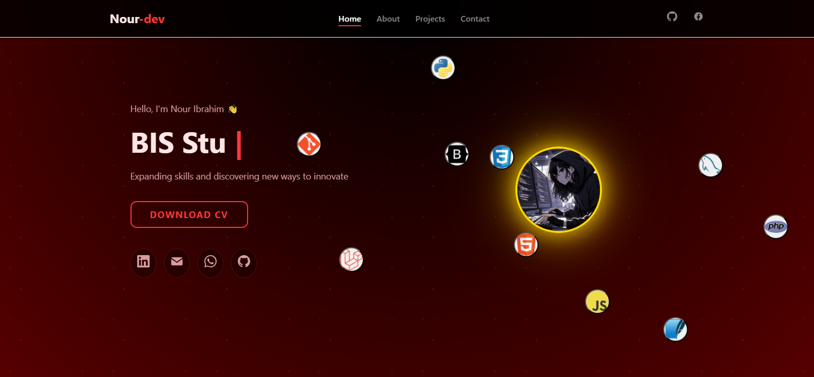

# 🌐 Nour Ibrahim Galal | Portfolio

Welcome to my personal portfolio website!  
I’m a **Full Stack Developer** and **BIS Student** passionate about building creative, responsive, and user-focused web applications.

---

## 🚀 Live Demo
👉 [View Portfolio](https://noor-20007.github.io/portfolio/)

---

## 🚀 Features

- ⚡ **Responsive Design** — Works perfectly on all devices  
- 🎨 **Typing Effect** — Animated text to showcase skills  
- 🌍 **Smooth Scroll** — Fluid navigation between sections  
- 💻 **Clean Structure** — Modular HTML, CSS, and JS  
- 📧 **Contact Form** — Integrated with [EmailJS](https://www.emailjs.com/) for instant messaging  

---

## 🧠 Tech Stack

| Category | Tools |
|-----------|--------|
| **Frontend** | HTML5, CSS3, JavaScript (ES6+) |
| **Animations** | CSS keyframes, IntersectionObserver |
| **Form Handling** | EmailJS |
| **Deployment** | GitHub Pages |

## 📫 Connect With Me
- **Email:** [nour.ibrahim.dev@gmail.com](mailto:nour.ibrahim.dev@gmail.com)
- **GitHub:** [noor-20007](https://github.com/noor-20007)

